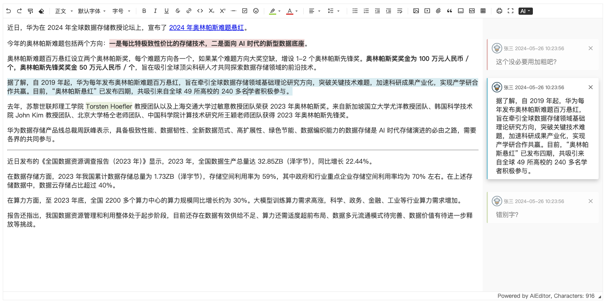

# 标注（或评论）
标注功能和 Word 的标注评论功能类似，可以选择一段文字对齐进行标注，如下图所示：



> PS：此功能在 Pro 版本（商业版）才有，开源版没有这个功能。 Pro 版预览地址：http://aieditor-pro.jpress.cn 

## 使用方法

```typescript
new AiEditor({
    element: "#aiEditor",
    comment: {
        enable: true,
        onCommentActivated: (commentIds) => {
            //当评论被激活时，鼠标选中了（或点击）了某段被标识的内容
        },

        onCommentCreate: (commentId, content, callback) => {
            //当评论被创建时，这里应该通过 http 请求把数据存放到数据库
            //保存成功后，调用 callback 使得评论生效
        },

        onCommentDelete: (commentId, callback) => {
           //当评论内容被删除时
        },

        onCommentQuery: (commentId, callback) => {
            //初次加载时根据评论 id 查询评论内容
        }
    },
})
```

- **enable**: 是否启用评论功能
- **onCommentActivated**: 监听评论被创建，此时我们应该把评论内容保存到数据库，并返回完整的评论信息
- **onCommentCreate**:  监听评论被创建，此时我们应该把评论内容保存到数据库，并返回完整的评论信息
- **onCommentDelete**:  监听评论被删除，此时应该同步删除数据库的评论
- **onCommentQuery**:  初次加载时，查询评论内容


## 示例代码

以下的示例代码，是使用了 LocalStorage 来保存评论内容

```typescript
const colors = ['#3f3f3f', '#938953', '#548dd4', '#95b3d7', 
    '#d99694', '#c3d69b', '#b2a2c7', '#92cddc', '#fac08f'];
new AiEditor({
    element: "#aiEditor",
    comment: {
        enable: true,
        onCommentActivated: (commentIds) => {
            //用户鼠标点击（或选中）了带有评论的内容
            console.log("commentIds", commentIds)
        },

        onCommentCreate: (commentId, content, callback) => {
            //根据 评论 id 和 内容，生成一条新的评论
            const comment = {
                id: commentId,
                account:"张三",
                avatar:"https://aieditor.dev/assets/image/logo.png",
                mainColor:colors[Math.floor(Math.random() * colors.length)],
                createdAt:"2024-05-26 10:23:56",
                content
            } as CommentInfo;
            
            //把评论信息保存到 localStorage
            localStorage.setItem("comment-" + commentId, JSON.stringify(comment));
            
            //调用 callback 传回 comment 信息
            return callback(comment);
        },

        onCommentDelete: (commentId, callback) => {
            //删除评论
            localStorage.removeItem("comment-"+commentId);
            return callback();
        },

        onCommentQuery: (commentId, callback) => {
            //从 localStorage 获取评论信息
            const contentJSON = localStorage.getItem("comment-"+commentId);
            if (!contentJSON) return false;

            //调用 callback 传回 comment 信息
            return callback(JSON.parse(contentJSON))
        }
    },
})
```

**CommentInfo** 评论信息描述
- id: 评论的 id，全局唯一
- account: 评论的账户或昵称
- avatar: 用户的头像 URL 地址
- mainColor: 评论的文字的背景颜色
- createdAt: 评论时间
- content: 评论内容